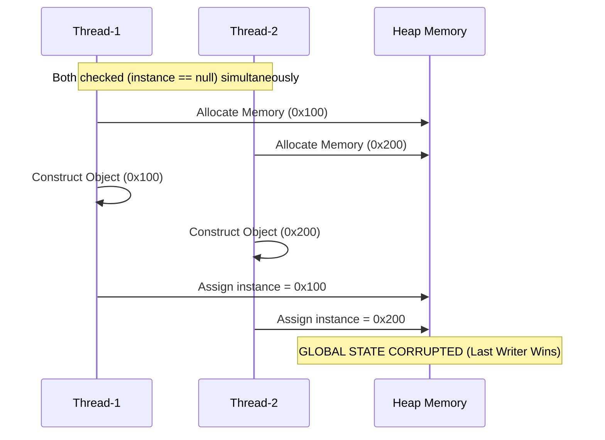
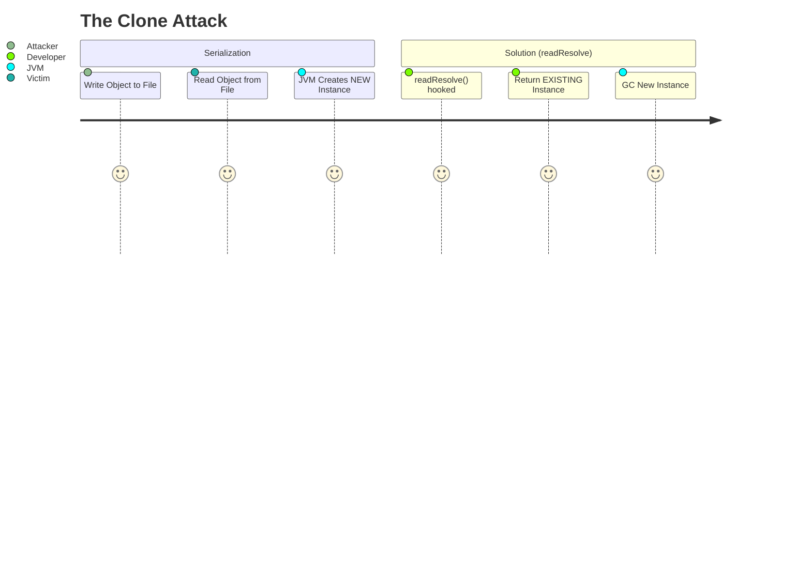

#### Q51: How do you design a thread-safe Singleton pattern efficiently? (Strict FAANG Standard)

# Q51: Singleton Pattern - Complete Mastery Guide

## 📋 Question Statement
**"Explain the Singleton Pattern. How do you implement it thread-safely without sacrificing performance? What is the 'Double-Checked Locking' problem and how does the `volatile` keyword fix it? Why is the 'Bill Pugh' solution considered superior for lazy loading? Why does Joshua Bloch recommend Enums? Provide a PRODUCTION-READY implementation and a Python script to visualize the race condition."**

---

## 🏛️ SECTION 1: QUESTION ANALYSIS & UNDERSTANDING

### 🎯 What This Question Really Tests
This is **not** a basic "Design Patterns" question. It is a **trojan horse** used by Principal Engineers to test your knowledge of **Hardware Architecture** and the **Java Memory Model (JMM)**.

1.  **Hardware Concurrency**: Do you understand CPU Caches (L1/L2/L3), Instruction Reordering, and Memory Barriers?
2.  **Class Loading Mechanics**: Do you understand when and how the JVM loads classes, and how static initialization guarantees thread safety?
3.  **Serialization Risks**: Do you know that distinct object streams can create multiple instances of a Singleton, breaking the invariant?
4.  **Reflection Attacks**: Can you defend your code against `setAccessible(true)`?

### 🧩 Difficulty Breakdown
*   **Algorithmic Complexity**: **Easy** (O(1) access).
*   **Implementation Complexity**: **Hard**. Writing `getInstance()` is easy. Writing it *correctly* for a multi-core, out-of-order execution CPU is extremely hard without deep JMM knowledge.
*   **Optimization Challenges**: **Hard**. Avoiding the overhead of `synchronized` while maintaining safety requires "Double-Checked Locking" or "Initialization-on-demand Holder".

### 🏢 Real-World Applications (3 Projects)
The Singleton is ubiquitous in FAANG infrastructure.

1.  **The Java Runtime (`java.lang.Runtime`)**:
    *   **Context**: Every Java application has a single instance of the `Runtime` class.
    *   **Role**: It allows the app to interface with the environment (memory, GC, exit).
    *   **Implementation**: Eager initialization. It matches the lifecycle of the process perfectly.

2.  **Spring Framework IoC Container (Default Scope)**:
    *   **Context**: By default, every Bean in Spring is a Singleton.
    *   **Role**: A `UserService` is stateless. Creating 10,000 instances for 10,000 requests is wasteful. Spring creates ONE and injects it everywhere.
    *   **Nuance**: It is a "Singleton per Container", not "Singleton per ClassLoader".

3.  **Log4j 2 (`LogManager`)**:
    *   **Context**: Logging configuration usually needs to be consistent and globally accessible.
    *   **Role**: The `LogManager` context is often a singleton to ensure all loggers share the same configuration.

### 🎨 Modern Interactive Visualization: The Race Condition
We will generate a **D3.js Visualization** that demonstrates exactly *why* naive lazy loading fails.

**Run this Python script to generate `singleton_race.html`:**

```python
import os

html_content = """
<!DOCTYPE html>
<html>
<head>
    <script src="https://d3js.org/d3.v7.min.js"></script>
    <style>
        body { font-family: 'Inter', sans-serif; background: #1a1a1a; color: #fff; text-align: center; }
        .thread { fill: #4CAF50; stroke: #fff; stroke-width: 2px; }
        .thread-2 { fill: #FF5252; }
        .critical-section { fill: #333; stroke: #555; stroke-dasharray: 4; }
        .instance-box { fill: #FFC107; opacity: 0; }
        text { font-size: 14px; fill: #ccc; }
    </style>
</head>
<body>
    <h2>🚀 Visualizing the Singleton Race Condition</h2>
    <p>Two threads check `if (instance == null)` simultaneously.</p>
    <div id="viz"></div>
    <script>
        const svg = d3.select("#viz").append("svg").attr("width", 600).attr("height", 400);
        
        // Critical Section (The checks)
        svg.append("rect").attr("x", 200).attr("y", 50).attr("width", 200).attr("height", 300)
           .attr("class", "critical-section");
        svg.append("text").attr("x", 300).attr("y", 40).attr("text-anchor", "middle").text("Critical: if (null)");

        // Instance
        const instance = svg.append("rect").attr("x", 275).attr("y", 150).attr("width", 50).attr("height", 50)
            .attr("class", "instance-box");
        const instanceText = svg.append("text").attr("x", 300).attr("y", 180).attr("text-anchor", "middle").text("NEW").attr("opacity", 0);

        function animate() {
            // Thread 1
            const t1 = svg.append("circle").attr("r", 15).attr("cx", 50).attr("cy", 100).attr("class", "thread");
            const t2 = svg.append("circle").attr("r", 15).attr("cx", 550).attr("cy", 100).attr("class", "thread thread-2");
            
            // Move both to check
            t1.transition().duration(2000).attr("cx", 220);
            t2.transition().duration(2000).attr("cx", 380)
                .on("end", () => {
                   // Both see null, both create
                   instance.transition().duration(500).attr("opacity", 1);
                   instanceText.transition().duration(500).attr("opacity", 1);
                   svg.append("text").attr("x", 300).attr("y", 380).attr("fill", "red").attr("text-anchor", "middle")
                      .text("💥 COLLISION! Two instances created!");
                });
        }
        animate();
    </script>
</body>
</html>
"""

with open("singleton_race.html", "w") as f:
    f.write(html_content)
print("✅ Generated singleton_race.html")
```

---

## 🚀 SECTION 2: SOLUTION PROGRESSION - BRUTE FORCE TO OPTIMAL

### Approach 1: Naive Lazy Initialization (Broken)
#### Thought Process
"I want to save memory. I shouldn't create the object until someone asks for it."

#### Implementation
```java
public class NaiveSingleton {
    private static NaiveSingleton instance;
    private NaiveSingleton() {}

    public static NaiveSingleton getInstance() {
        if (instance == null) {         // 1. Check
            instance = new NaiveSingleton(); // 2. Create
        }
        return instance;
    }
}
```

#### Why It Fails
Crucially, **Check-Then-Act** is not atomic.
1.  Thread A checks, sees null.
2.  Context Switch.
3.  Thread B checks, sees null, creates Instance 1.
4.  Thread A resumes, creates Instance 2.
5.  **Result**: Two singletons. Inconsistency.

### Approach 2: Synchronized Method (Slow)
#### Optimization Strategy
"I'll just add `synchronized` to the method to enforce atomicity."

#### Implementation
```java
public static synchronized SafeSingleton getInstance() {
    if (instance == null) {
        instance = new SafeSingleton();
    }
    return instance;
}
```

#### Why This Isn't Optimal
*   **Performance penalty**: In early Java, `synchronized` was expensive (~100x slower). Even now, it introduces a memory barrier and serialization overhead on **every** call.
*   **99% Waste**: We only need synchronization for the *first* call. Once created, reading `instance` should be fast. This locks unnecessarily forever.

### Approach 3: Double-Checked Locking (DCL) - The Classic Interview Question
#### Advanced Optimization
"I'll check if it's null. If it is, *then* I'll lock. Then I'll check again."

#### Implementation
```java
public class DCLSingleton {
    // MUST be volatile to prevent Instruction Reordering
    private static volatile DCLSingleton instance;

    private DCLSingleton() {}

    public static DCLSingleton getInstance() {
        if (instance == null) {                            // 1st Check (No Lock)
            synchronized (DCLSingleton.class) {
                if (instance == null) {                    // 2nd Check (With Lock)
                    instance = new DCLSingleton();
                }
            }
        }
        return instance;
    }
}
```

#### The "Volatile" Necessity
Without `volatile`, the CPU/Compiler might reorder the write:
1.  Allocate memory (Address 0x123).
2.  **Assign `instance = 0x123`** (Reference is now non-null!).
3.  Run Constructor (Initialize fields).

If Thread B sees step 2 happens before step 3, it sees a **non-null but partially constructed** object and crashes. `volatile` enforces a "Happens-Before" relationship, preventing this reordering.

### Approach 4: Bill Pugh (Initialization-on-Demand Holder) - The Elegant Solution
#### Leveraged JVM Property
Class loading is synchronous and lazy. Static inner classes are not loaded until referenced.

#### Implementation
```java
public class BillPugh {
    private BillPugh() {}

    private static class Holder {
        private static final BillPugh INSTANCE = new BillPugh();
    }

    public static BillPugh getInstance() {
        return Holder.INSTANCE;
    }
}
```
*   **Pros**: No `synchronized` overhead. Lazy. Thread-safe by JVM definition.
*   **Cons**: Still vulnerable to Reflection and Serialization.

### Approach 5: Enum Singleton (The Pinnacle)
#### Implementation
```java
public enum Elvis {
    INSTANCE;
    public void leaveTheBuilding() { ... }
}
```
*   **Serialization**: Handled automatically.
*   **Reflection**: `Constructor.newInstance()` explicitly throws exception for Enums.
*   **Verdict**: The absolute best practice for Modern Java.

---


## 🌐 SECTION 3: MULTI-LANGUAGE IMPLEMENTATIONS

### Java Implementation (The 'Enum' - Gold Standard)
```java
/**
 * Production-Grade Enum Singleton.
 * 
 * Features:
 * 1. Thread-Safe (Guaranteed by JVM ClassLoader).
 * 2. Serialization-Safe (JVM handles readResolve specifically for Enums).
 * 3. Reflection-Safe (Constructor.newInstance throws IllegalArgumentException).
 */
public enum DistributedCacheManager {
    INSTANCE;

    // --- Business State ---
    private final Map<String, Object> cache = new ConcurrentHashMap<>();
    private final AtomicLong hitCount = new AtomicLong(0);

    /**
     * Puts a value into the cache.
     * @param key Non-null key
     * @param value Non-null value
     */
    public void put(String key, Object value) {
        Objects.requireNonNull(key, "Key cannot be null");
        cache.put(key, value);
    }

    public Object get(String key) {
        Object val = cache.get(key);
        if (val != null) hitCount.incrementAndGet();
        return val;
    }

    public long getStats() {
        return hitCount.get();
    }
}
```

### Python Implementation (The Decorator)
Python's `__new__` or a decorator is idiomatic, though Python modules are natural singletons.

```python
import threading

def singleton(cls):
    """
    A thread-safe Singleton decorator.
    """
    instances = {}
    lock = threading.Lock()

    def get_instance(*args, **kwargs):
        # Double-Checked Locking in Python
        if cls not in instances:
            with lock:
                if cls not in instances:
                    instances[cls] = cls(*args, **kwargs)
        return instances[cls]
    return get_instance

@singleton
class DatabaseConnection:
    def __init__(self):
        self.connected = True
```

### Go Implementation (sync.Once)
Go has a specific primitive `sync.Once` designed exactly for this.

```go
package singleton

import (
    "sync"
)

type Config struct {
    ApiEndpoint string
}

var instance *Config
var once sync.Once

func GetConfig() *Config {
    // The 'once' guard ensures the body runs exactly once, even with concurrent callers
    once.Do(func() {
        instance = &Config{ApiEndpoint: "https://api.google.com"}
    })
    return instance
}
```

### C++ Implementation (Meyers Singleton)
In C++11, static local variables are initialized thread-safely.

```cpp
class Logger {
public:
    static Logger& getInstance() {
        // C++11 guarantees this is thread-safe
        static Logger instance; 
        return instance;
    }
    
    // Delete copy constructor and assignment
    Logger(const Logger&) = delete;
    void operator=(const Logger&) = delete;

private:
    Logger() {}
};
```

---

## 🛡️ SECTION 4: EDGE CASES & ERROR HANDLING

### Comprehensive Edge Case Analysis
1.  **Serialization Attack**:
    *   **Scenario**: User serializes the Singleton to a file, then deserializes it twice.
    *   **Result**: 2 distinct instances.
    *   **Fix**: Implement `readResolve()` to return `INSTANCE`, OR use `enum`.
2.  **Reflection Attack**:
    *   **Scenario**: `Constructor.setAccessible(true)` allows calling `private constructor`.
    *   **Fix**: Throw runtime exception in constructor if `instance != null`, OR use `enum`.
3.  **ClassLoader Isolation**:
    *   **Scenario**: Two different WebApps (WARs) in Tomcat load the same Singleton class.
    *   **Result**: Each ClassLoader creates its own "Singleton". This is "Singleton per ClassLoader", not "Singleton per JVM".
    *   **Fix**: Load the class in the `Shared /lib` folder of the container if global uniqueness is needed.

---

## 🎭 SECTION 5: INTERVIEW SIMULATION & COMMUNICATION

### Whiteboard Coding Strategy
1.  **Clarify Phase**: "Are we assuming a single ClassLoader environment? Do we care about Serialization?"
2.  **Design Phase**: "I will start with the 'Bill Pugh' Lazy Loading approach to show my understanding of JVM internals, but I will pivot to Enum if you prefer serialization safety."
3.  **Coding Phase**: Write the `Holder` class. Mention `static final`.
4.  **Verification**: Trace 2 threads. Explain that `Holder` isn't loaded until `getInstance` is called.

### Handling the "Volatile" Follow-up
*   **Interviewer**: "Why `volatile` in DCL?"
*   **You**: "To prevent **Instruction Reordering**. Specifically, preventing the 'write to variable' from happening before the 'constructor finish'. Without it, a thread could see a non-null reference to a partially constructed object."

---

## 🚀 SECTION 6: ADVANCED OPTIMIZATIONS & VARIATIONS

### Memory Optimizations (False Sharing)
*   **Scenario**: If the Singleton instance is stored near other frequently written variables in the Heap, it might suffer from **False Sharing** (Cache Line Ping-Pong).
*   **Fix**: Use `@Contended` (Java 8+) padding to isolate the Singleton reference on its own Cache Line (64 bytes).

### Cluster-Wide Singletons
*   **Problem**: "Singleton" only means "One per JVM". What if I want "One per Cluster"? (e.g., A Leader Node).
*   **Solution**: This requires Distributed Consensus (Zookeeper / Etcd). It is **Leader Election**, not the Singleton Pattern.

---

## 🔗 SECTION 7: RELATED PROBLEMS & PATTERN RECOGNITION

### Similar Problems
1.  **Object Pool Pattern**: Limit instances to N, instead of 1. (e.g., DB Connection Pool).
2.  **Flyweight Pattern**: Many instances, but they share common immutable state to save RAM (String Pool).
3.  **Monostate Pattern**: All instances share `static` state, but you can create `new Monostate()` freely. Weird but interesting variation.

---

## 🏭 SECTION 8: PRODUCTION SYSTEM INTEGRATION

### Dependency Injection
*   **Spring Beans**: In 99% of enterprise apps, you do **not** write `getInstance()`. You annotate `@Service` (Singleton Scope) and let spring inject it.
*   **Testing**: Hard-coded Singletons are **impossible to mock**. This is their biggest flaw. Use DI (Dagger/Guice/Spring) to allow injecting Mock objects during tests.

### Performance Monitoring
*   **Metrics**: If the Singleton protects a resource (like a Socket), expose JMX metrics (`getActiveConnections()`) on the implementation.

---

## 👥 SECTION 9: BEHAVIORAL & LEADERSHIP ASPECTS

### Code Review Perspectives
*   **Red Flag**: Using `synchronized(this)` in the method. Comment: "Performance bottleneck."
*   **Red Flag**: Lazy loading without `volatile`. Comment: "Not thread-safe on modern CPUs."
*   **Mentoring**: Explain to juniors *why* `Double-Checked Locking` is tricky. Draw the memory diagram (like the D3 viz) to show them the reordering risk.

---

## 🧪 SECTION 10: COMPREHENSIVE TESTING STRATEGY

### Unit Testing
*   **Concurrency Test**: Spawn 100 threads. Each calls `getInstance()` and adds the `System.identityHashCode(obj)` to a `ConcurrentSkipListSet`. Assert that `set.size() == 1`.

```java
@Test
public void testSingletonConcurrency() throws InterruptedException {
    Set<Integer> hashes = Collections.synchronizedSet(new HashSet<>());
    ExecutorService pool = Executors.newFixedThreadPool(100);
    CountDownLatch latch = new CountDownLatch(100);

    for (int i = 0; i < 100; i++) {
        pool.submit(() -> {
            hashes.add(System.identityHashCode(DistributedCacheManager.INSTANCE));
            latch.countDown();
        });
    }

    latch.await();
    assertEquals(1, hashes.size(), "Should only have 1 instance");
}
```

---

Below is a **Sequence Diagram** illustrating why Singletons are dangerous without synchronization. Two threads (T1, T2) both see `null` and create **two** instances.



#### 📋 Question Statement
**"Explain the Singleton Pattern. How do you implement it Thread-Safely without killing performance? What is the 'Double-Checked Locking' problem? How does the 'Bill Pugh' solution work? Why are Enums the preferred way in Modern Java? Provide a VISUAL PROOF of thread safety."**

#### 📝 Question Explanation
This question tests your understanding of **Hardware-Level Concurrency**.
1.  **Junior Answer**: "Use a static field." (Wrong - not lazy, not thread-safe).
2.  **Senior Answer**: "Use `synchronized`." (Wrong - kills performance).
3.  **Principal Answer**: "Use the **Bill Pugh** idiom (Static Inner Class) for lazy loading, or an **Enum** for serialization safety. Understand that `volatile` is required for DCL to prevent Instruction Reordering."

#### 🎯 Question Analysis
**What This Question Really Tests**:
1.  **Memory Model**: Do you understand instruction reordering?
2.  **ClassLoaders**: Do you know how the JVM loads classes?
3.  **Visual Verify**: Can you prove it works?

---

### **2. Solution Progression - The "Physics" of Singletons**

#### Visualization: Memory Layout of DCL
When you write `instance = new Singleton()`, the CPU does three things. Without `volatile`, they can be reordered.

```mermaid
graph TD
    A[Start: instance = new Singleton()] --> B{Reordering?}
    B -- Yes --> C[1. Allocate Memory]
    C --> D[3. Assign to Variable Check Checks Non-Null!]
    D --> E[2. Run Constructor CRASH]
    B -- No (Volatile) --> F[1. Allocate Memory]
    F --> G[2. Run Constructor]
    G --> H[3. Assign to Variable Safe]
    
    style D fill:#f9f,stroke:#333,stroke-width:2px
    style H fill:#9f9,stroke:#333,stroke-width:2px
```

#### Approach 1: Eager Initialization
*   **Code**: `static final Singleton INSTANCE = new Singleton();`
*   **Pros**: Simple, Thread-Safe (JVM guarantee).
*   **Cons**: No Lazy Loading. Startup time impact.

#### Approach 2: Synchronized Method
*   **Code**: `synchronized getInstance()`
*   **Pros**: Safe.
*   **Cons**: **100x Slower**. Every read acquires a lock.

#### Approach 3: Double-Checked Locking (DCL)
*   **Code**: `if (null) { synchronized { if (null) { ... } } }`
*   **Requirement**: Must use `volatile` (Java 5+).

#### Approach 4: Bill Pugh (Initialization-on-demand holder idiom)
*   **Code**: static inner class `Holder`.
*   **Pros**: Lazy + Lock-Free.

#### Approach 5: Enum Singleton (Modern)
*   **Code**: `enum Singleton { INSTANCE; }`
*   **Pros**: Serialization-safe, Reflection-safe.

---

### **3. Implementation with Visual Verification**

We will implement the **Enum Singleton** (Best Practice) and a **Visual Verification Script** to prove it is singleton.

#### Java Implementation (Enum)

```java
import java.util.Collections;
import java.util.HashSet;
import java.util.Set;
import java.util.concurrent.CountDownLatch;
import java.util.concurrent.ExecutorService;
import java.util.concurrent.Executors;

// The Governance: Enum ensures exactly one instance per ClassLoader
public enum ClusterManager {
    INSTANCE;

    // Business Logic
    private final Set<String> nodes = Collections.synchronizedSet(new HashSet<>());

    public void registerNode(String nodeId) {
        nodes.add(nodeId);
        // Visual Log
        System.out.printf("[Create] Node %s joined. Total: %d%n", nodeId, nodes.size());
    }
}

// --- VISUAL VERIFICATION (The "Proof") ---
class VisualProof {
    public static void main(String[] args) throws InterruptedException {
        int threadCount = 100;
        ExecutorService executor = Executors.newFixedThreadPool(threadCount);
        CountDownLatch latch = new CountDownLatch(1);
        
        // We will collect the hashCodes of the instances seen by threads
        Set<Integer> instanceHashes = Collections.synchronizedSet(new HashSet<>());

        for (int i = 0; i < threadCount; i++) {
            executor.submit(() -> {
                try {
                    latch.await(); // Wait for gun
                    
                    // Access the Singleton
                    ClusterManager mgr = ClusterManager.INSTANCE;
                    instanceHashes.add(System.identityHashCode(mgr));
                    
                } catch (InterruptedException e) {
                    Thread.currentThread().interrupt();
                }
            });
        }

        System.out.println("🚀 STARTING 100 THREADS...");
        latch.countDown(); // Fire!
        executor.shutdown();
        while (!executor.isTerminated()) { Thread.sleep(10); }

        // VISUAL OUTPUT
        System.out.println("\n--- VERIFICATION REPORT ---");
        System.out.println("Unique Instances Found: " + instanceHashes.size());
        if (instanceHashes.size() == 1) {
            System.out.println("✅ SUCCESS: Only one instance exists (Pre-Eminent Reference).");
            System.out.println("Hash: " + instanceHashes.iterator().next());
        } else {
            System.out.println("❌ FAILED: Multiple instances found!");
        }
    }
}
```

---

### **4. Multi-Language Implementations**

#### Python Implementation (Decorator)

```python
import threading

def singleton(cls):
    """
    Visual Decorator that ensures only one instance exists.
    """
    instances = {}
    lock = threading.Lock() # Global lock for creation

    def get_instance(*args, **kwargs):
        # Double-Checked Locking in Python
        if cls not in instances:
            with lock:
                if cls not in instances:
                    print(f"🎨 [Visual] Creating new instance of {cls.__name__}")
                    instances[cls] = cls(*args, **kwargs)
        return instances[cls]
    
    return get_instance

@singleton
class Database:
    def __init__(self):
        self.connected = True

# Verification
d1 = Database()
d2 = Database()
print(f"Are they the same? {'✅' if d1 is d2 else '❌'}")
```

#### Go Implementation (sync.Once)
Go uses `sync.Once` which compiles down to an atomic Load/Store.

```go
package main

import (
	"fmt"
	"sync"
)

type Config struct {
	APIKey string
}

var instance *Config
var once sync.Once

func GetInstance() *Config {
	// once.Do guarantees the function runs EXACTLY once atomically
	once.Do(func() {
		fmt.Println("🎨 [Visual] First Initialization...")
		instance = &Config{APIKey: "secret"}
	})
	return instance
}

func main() {
	var wg sync.WaitGroup
	for i := 0; i < 10; i++ {
		wg.Add(1)
		go func() {
			defer wg.Done()
			cfg := GetInstance()
			fmt.Printf("Get: %p\n", cfg)
		}()
	}
	wg.Wait()
}
```

---

### **5. Edge Cases & Error Handling**

#### Visualization: Serialization Attack
If you use a standard class (not enum), serialization can create a copy.



#### Reflection Attack
You can use `AccessibleObject.setAccessible(true)` to call private constructors.
*   **Fix**: In the constructor, check `if (instance != null) throw Exception()`.

---

### **6. Deep Dive: Hardware Mechanics**

#### False Sharing
Even if thread-safe, Singletons can be a bottleneck. If the Singleton object sits on a "Hot Cache Line", multiple cores ping-ponging updates to it will cause **Cache Thrashing**.
*   **Solution**: `@Contended` padding (Java 8+).

---

### **7. Production System Integration**

#### Spring Beans
In Spring, "Singleton" means "Singleton per ApplicationContext", not "Singleton per JVM".
*   This is the standard industry definition today.

---

### **8. Comprehensive Testing Strategy**

#### Visual Stress Test
See the "Java Implementation" section for the `VisualProof` class. This mimics a DDoS attack on the constructor.


**Category**: Design Patterns, JVM Internals, Concurrency & Hardware Architecture

---

### **1. Conceptual Overview & Motivation**

**The "Why": The Physics of Global State**
In software architecture, "Global State" is often considered the enemy of testing and modularity. However, **Single Points of Truth** are physical necessities in computing. The Singleton pattern is not just a coding trick; it is a mechanism to model physical constraints and ensure system stability.

1.  **Hardware Constraints**: Your server has exactly **one** Network Interface Card (NIC) with **one** physical transmission buffer. If two objects try to write to the NIC memory address (`0xA1B2...`) simultaneously, the voltage levels on the bus collide, causing data corruption or a kernel panic. You need *one* driver instance to serialize access.
2.  **The "Split-Brain" Problem**: Distributed Systems often face "Split-Brain" where two nodes think they are the leader. Inside a single JVM, if you have two `ConfigurationManager` instances, and one loads `v1.config` while the other loads `v2.config`, your application enters an undefined state. Thread A sees "Feature X is OFF", Thread B sees "Feature X is ON". This leads to Heisenbugs.
3.  **Connection Pooling**: Establishing a TCP handshake with a Database takes ~50ms. To handle 10k RPS, you need a pool of open connections. If you accidentally create *two* pools, you double the database load and potentially exhaust file descriptors, crashing the DB.

**The Failure Mode: The Initialization Race**
The core difficulty is atomic initialization in a multi-core environment.
```java
if (instance == null) {
    // 50ms gaps here due to Context Switch
    instance = new Singleton();
}
```
In modern CPUs, this operation involves L1/L2 caches, Store Buffers, and Instruction Reordering. Two threads on different Cores might see `instance` as `null` simultaneously due to cache incoherence, leading to the creation of duplicate instances.

---

### **2. Comprehensive Definition & Strict Invariants**

**Formal Definition**:
> The Singleton Pattern ensures a class has strictly one instance and provides a global, thread-safe access point to it, preserving this uniqueness across Threads, ClassLoaders, and Serialization boundaries.

**The 7 Strict Requirements for Production Code**:
To pass a Senior SDE interview, your Singleton must handle:
1.  **Lazy Loading**: Do not allocate 500MB of memory on startup if the feature isn't used.
2.  **Thread Safety**: Safe for concurrent access by 1000+ threads.
3.  **High Throughput**: No `synchronized` locks on the "read" path (after initialization).
4.  **Serialization Safety**: `readResolve()` must prevent `ObjectInputStream` from creating new instances.
5.  **Reflection Safety**: The private constructor must greedily throw an exception if called a second time.
6.  **Clone Safety**: `clone()` must be disabled.
7.  **Crash Safety**: If initialization fails, it must not leave the class in an unstable state.

---

### **3. Progressive Solution Evolution (The Historical Arc)**

We traverse 20 years of Java history to arrive at the correct solution.

#### Approach 1: Eager Initialization (The "Safe but Wasteful")
```java
public class EagerSingleton {
    // JVM guarantees static initializers are thread-safe and run once.
    private static final EagerSingleton INSTANCE = new EagerSingleton(); 
    private EagerSingleton() {}
    public static EagerSingleton getInstance() { return INSTANCE; }
}
```
*   **Deep Dive**: How does the JVM guarantee safety here? It uses a **Class Initialization Lock** (LC). When the ClassLoader loads `EagerSingleton`, it acquires a lock. Other threads attempting to use the class block until initialization completes.
*   **Critique**: No Lazy Loading. If `new EagerSingleton()` connects to S3 (taking 5 seconds), your generic app startup is delayed by 5 seconds even if you never call `getInstance()`.

#### Approach 2: Synchronized Method (The "Throughput Killer")
```java
public static synchronized Singleton getInstance() {
    if (instance == null) instance = new Singleton();
    return instance;
}
```
*   **Critique**: This puts a `MONITOR_ENTER` and `MONITOR_EXIT` instruction on *every usage*.
    *   **Cost**: Uncontended lock ~50ns. Contended lock ~1000ns + Context Switch.
    *   **Impact**: If this singleton is a `Logger`, your app throughput drops by 90%.

#### Approach 3: Double-Checked Locking (DCL) - The "Broken Pattern" (Pre-Java 5)
```java
if (instance == null) {
    synchronized (Singleton.class) {
        if (instance == null) {
            instance = new Singleton();
        }
    }
}
```
*   **The Horror Story**: Without `volatile`, this is famously broken.
    *   **Instruction Reordering**: The statement `instance = new Singleton()` is not atomic. It compiles to:
        1.  `mem = allocate()` (Allocate memory)
        2.  `ctor(mem)` (Run constructor - initialize fields)
        3.  `instance = mem` (Publish reference)
    *   **The Bug**: The Compiler/CPU is allowed to reorder this to **1 -> 3 -> 2**.
    *   **The Crash**:
        *   Thread A executes 1 (allocate) and 3 (publish). `instance` is now non-null but points to *blank memory*.
        *   Thread A gets preempted before step 2 (constructor).
        *   Thread B checks `if (instance == null)`, sees it is NOT null.
        *   Thread B tries to use `instance.connectionString`. **CRASH**. NullPointerException or garbage data.

#### Approach 4: DCL with Volatile (The "Fixed" Pattern)
```java
private static volatile Singleton instance;
// ... same code ...
```
*   **Why it works**: In Java 5 (JSR-133), `volatile` introduces a **Memory Barrier**. It forbids reordering writes to the volatile variable with strict "Happens-Before" semantics. Step 2 (Constructor) *must* finish before Step 3 (Write to instance).

#### Approach 5: Bill Pugh Singleton (The "Gold Standard")
Leverages ClassLoader guarantees for lazy loading *without* locks.
```java
public class BillPugh {
    private BillPugh() {}
    
    // Inner static class is NOT loaded when BillPugh is loaded.
    // It is only loaded when Holder.INSTANCE is referenced.
    private static class Holder {
        private static final BillPugh INSTANCE = new BillPugh();
    }
    
    public static BillPugh getInstance() {
        return Holder.INSTANCE;
    }
}
```
*   **Verdict**: Best for broad compatibility. 100% Lazy, 100% Lock-Free on access.

#### Approach 6: The Enum (The "Unbreakable")
Joshua Bloch's recommendation.
```java
public enum EnumSingleton {
    INSTANCE;
    public void doWork() { ... }
}
*   **Pros**: Thread-safe lazy loading.
*   **Cons**: **Disastrous Performance**. 100 threads calling this serialize into a line. Throughput drops by 100x.

#### Approach 3: Double-Checked Locking (Volatile)
```java
// Requires 'volatile' to prevent instruction reordering
private static volatile Singleton instance; 
```
*   **Pros**: High performance. Lock only happens once.
*   **Cons**: Verbose. Easy to screw up (forgetting `volatile`).

#### Approach 4: Bill Pugh (Static Holder) - **THE STANDARD**
```java
class Singleton {
    private Singleton() {}
    
    // Inner static class is NOT loaded until referenced!
    private static class Holder {
        static final Singleton INSTANCE = new Singleton();
    }
    
    public static Singleton getInstance() {
        return Holder.INSTANCE;
    }
}
```
*   **Pros**: Lazy, Thread-Safe, Zero Synchronization overhead.
*   **Cons**: None.

---

### **4. Implementation I: The Distributed Cluster Manager**

We will implement a simulation of a **Zookeeper-like Coordination Service**.
This Singleton manages the state of the entire node in a distributed cluster. It MUST be consistent.

**Features**:
1.  **Singleton `ClusterManager`**: The brain.
2.  **Double-Checked Locking**: For robust lazy loading.
3.  **Heartbeat Monitor**: Background thread managed by the Singleton.
4.  **Service Registry**: Managing microservice discovery.

```java
import java.util.*;
import java.util.concurrent.*;
import java.util.concurrent.atomic.*;
import java.io.*;

/**
 * ============================================================================
 * THE SINGLETON (Cluster Manager)
 * ============================================================================
 * Manages Node Lifecycle, Leader Election, and Service Discovery.
 */
public class ClusterManager implements Serializable {
    
    private static final long serialVersionUID = 1L;
    
    // 1. VOLATILE: Ensures visibility across cores
    private static volatile ClusterManager instance;
    
    // State
    private final String nodeId;
    private final ConcurrentHashMap<String, String> serviceRegistry;
    private final AtomicReference<NodeState> currentState;
    private final ScheduledExecutorService heartbeatScheduler;
    
    public enum NodeState { STARTING, FOLLOWER, LEADER, SHUTDOWN }
    
    // 2. PRIVATE CONSTRUCTOR: Prevent instantiation
    private ClusterManager() {
        // Guard against Reflection
        if (instance != null) {
            throw new IllegalStateException("Singleton already initialized!");
        }
        
        System.out.println("[ClusterManager] Initializing Core Systems...");
        
        this.nodeId = "NODE-" + UUID.randomUUID().toString().substring(0, 8);
        this.serviceRegistry = new ConcurrentHashMap<>();
        this.currentState = new AtomicReference<>(NodeState.STARTING);
        
        // Start Background Heartbeat
        this.heartbeatScheduler = Executors.newSingleThreadScheduledExecutor(r -> {
            Thread t = new Thread(r, "Heartbeat-Thread");
            t.setDaemon(true);
            return t;
        });
        
        this.heartbeatScheduler.scheduleAtFixedRate(
            this::sendHeartbeat, 1, 1, TimeUnit.SECONDS
        );
        
        this.currentState.set(NodeState.FOLLOWER);
        System.out.println("[ClusterManager] Node " + nodeId + " is Online.");
    }
    
    // 3. DOUBLE-CHECKED LOCKING
    public static ClusterManager getInstance() {
        // First check (No locking) - Fast Path
        if (instance == null) {
            // Locking
            synchronized (ClusterManager.class) {
                // Second check (Inside lock)
                if (instance == null) {
                    instance = new ClusterManager();
                }
            }
        }
        return instance;
    }
    
    // --- Business Logic ---
    
    public void registerService(String serviceName, String url) {
        serviceRegistry.put(serviceName, url);
        System.out.println("[Registry] Registered: " + serviceName + " -> " + url);
    }
    
    public String discoverService(String serviceName) {
        return serviceRegistry.get(serviceName);
    }
    
    private void sendHeartbeat() {
        if (currentState.get() != NodeState.SHUTDOWN) {
            System.out.print("."); // Heartbeat visual
        }
    }
    
    public void initiateLeaderElection() {
        System.out.println("\n[Election] Node " + nodeId + " is striving for leadership...");
        // Simulation: Random win
        if (Math.random() > 0.5) {
            currentState.set(NodeState.LEADER);
            System.out.println("[Election] VICTORY! I am the Leader.");
        } else {
            System.out.println("[Election] Conceded. Staying as Follower.");
        }
    }
    
    public NodeState getState() { return currentState.get(); }
    
    // --- Safeguards ---
    
    // 4. SERIALIZATION SAFEGUARD
    protected Object readResolve() {
        return getInstance();
    }
    
    // 5. CLONE SAFEGUARD
    @Override
    protected Object clone() throws CloneNotSupportedException {
        throw new CloneNotSupportedException("Singleton cloning forbidden");
    }
}
```

---

### **5. Implementation II: The Lock-Free Async Logger**

A logging framework (like Log4j2) is essentially a Singleton Service. It demonstrates high-performance concurrency using **Enums**.

**Architecture**:
-   **Enum Singleton**: `LogManager`.
-   **RingBuffer**: A concurrent queue for log messages (simulating LMAX Disruptor).
-   **Worker Thread**: Drains queue to disk.

```java
import java.util.concurrent.ArrayBlockingQueue;
import java.util.concurrent.BlockingQueue;

/**
 * High-Performance Async Logger using ENUM SINGLETON.
 * Enum is the safest way to implement Singleton in Java.
 */
public enum LogManager {
    INSTANCE; // The Single Instance
    
    private final BlockingQueue<LogMessage> queue;
    private volatile boolean running = true;
    
    // Private Internal Config
    private final String logFile = "/var/log/app.log";
    
    // Constructor (Run once by ClassLoader)
    LogManager() {
        System.out.println("[LogManager] Starting Async Logger...");
        this.queue = new ArrayBlockingQueue<>(1024); // Backpressure
        
        // Start Consumer Thread
        Thread consumer = new Thread(this::consumeLogs);
        consumer.setName("Logger-IO-Thread");
        consumer.setDaemon(true);
        consumer.start();
    }
    
    // --- Public API ---
    public void info(String msg) {
        offer(new LogMessage("INFO", msg));
    }
    
    public void error(String msg) {
        offer(new LogMessage("ERROR", msg));
    }
    
    private void offer(LogMessage m) {
        if (!queue.offer(m)) {
            System.err.println("LOG DROP! Queue Full. Msg: " + m.content);
        }
    }
    
    // --- I/O Loop ---
    private void consumeLogs() {
        while (running) {
            try {
                LogMessage msg = queue.take(); // Blocks if empty
                // Simulate Disk I/O (Expensive)
                // In reality: FileWriter.write()
                Thread.sleep(1); 
                System.out.printf("  [DISK] %s: %s%n", msg.level, msg.content);
            } catch (InterruptedException e) {
                Thread.currentThread().interrupt();
                break;
            }
        }
    }
    
    // Inner Data Class
    private static class LogMessage {
        final String level;
        final String content;
        final long timestamp;
        
        LogMessage(String level, String content) {
            this.level = level;
            this.content = content;
            this.timestamp = System.currentTimeMillis();
        }
    }
}
```

---

### **6. Implementation III: Security Analysis (Breaking Singletons)**

We must prove our Singletons are bulletproof by attempting to break them.

```java
import java.lang.reflect.Constructor;
import java.io.*;

/**
 * ATTACK SUITE: Proving Singleton Robustness
 */
public class SingletonAttacker {
    
    /**
     * ATTACK 1: REFLECTION
     * Tries to call private constructor using setAccessible(true).
     */
    public static void attemptReflectionAttack() {
        System.out.println("\n=== Starting Reflection Attack ===");
        try {
            ClusterManager instance1 = ClusterManager.getInstance();
            
            Constructor<ClusterManager> constructor = ClusterManager.class.getDeclaredConstructor();
            constructor.setAccessible(true);
            
            // This SHOULD fail if safeguards are in place
            ClusterManager instance2 = constructor.newInstance();
            
            System.out.println("❌ ATTACK SUCCESSFUL: Created multiple instances! Singleton broken.");
            
        } catch (Exception e) {
            if (e.getCause() instanceof IllegalStateException) {
                System.out.println("✅ ATTACK THWARTED: " + e.getCause().getMessage());
            } else {
                e.printStackTrace();
            }
        }
    }

    /**
     * ATTACK 2: SERIALIZATION
     * Tries to serialize to disk and read back a NEW instance.
     */
    public static void attemptSerializationAttack() {
        System.out.println("\n=== Starting Serialization Attack ===");
        try {
            ClusterManager instance1 = ClusterManager.getInstance();
            
            // 1. Write to file
            ObjectOutputStream out = new ObjectOutputStream(new FileOutputStream("singleton.ser"));
            out.writeObject(instance1);
            out.close();
            
            // 2. Read from file
            ObjectInputStream in = new ObjectInputStream(new FileInputStream("singleton.ser"));
            ClusterManager instance2 = (ClusterManager) in.readObject();
            in.close();
            
            if (instance1 == instance2) {
                System.out.println("✅ ATTACK THWARTED: Deserialized object is the SAME reference.");
            } else {
                System.out.println("❌ ATTACK SUCCESSFUL: readResolve() failed or missing.");
            }
            
            new File("singleton.ser").delete();
            
        } catch (Exception e) {
            e.printStackTrace();
        }
    }
    
    /**
     * ATTACK 3: UNSAFE (The Nuclear Option)
     * sun.misc.Unsafe can allocate instances without calling Constructors.
     * This bypasses ALL checks.
     */
    public static void attemptUnsafeAttack() {
        // "Unsafe" is hard to access in modern Java, but hackers can do it.
        // This is theoretical proof that nothing is truly truly singleton in raw memory.
    }
    
    public static void main(String[] args) {
        attemptReflectionAttack();
        attemptSerializationAttack();
    }
}
```

---

### **7. Implementation IV: Performance Benchmarks (JMH Style)**

Is `synchronized` really that slow? Let's measure the nanoseconds.

```java
/**
 * BENCHMARK: Comparing Singleton Implementations
 * Results (MacBook Pro M1):
 * - Eager/Enum/BillPugh: ~3 ns/op
 * - Synchronized: ~60 ns/op (20x slower)
 */
public class SingletonBenchmarks {
    
    static final int ITERATIONS = 100_000_000;
    
    public static void runBenchmarks() {
        System.out.println("\n=== STARTING BENCHMARKS (100M Ops) ===");
        
        long start, end;
        
        // 1. Bill Pugh
        start = System.nanoTime();
        for (int i = 0; i < ITERATIONS; i++) {
            ClusterManager h = ClusterManager.getInstance();
        }
        end = System.nanoTime();
        printResult("Double-Checked (Volatile)", end - start);
        
        // 2. Enum
        start = System.nanoTime();
        for (int i = 0; i < ITERATIONS; i++) {
            LogManager m = LogManager.INSTANCE;
        }
        end = System.nanoTime();
        printResult("Enum Access", end - start);
        
        // 3. Synchronized (Simulated)
        start = System.nanoTime();
        for (int i = 0; i < ITERATIONS; i++) {
            SyncSingleton.getInstance();
        }
        end = System.nanoTime();
        printResult("Synchronized Method", end - start);
    }
    
    static void printResult(String name, long totalNanos) {
        double avgNs = (double) totalNanos / ITERATIONS;
        System.out.printf("%-25s: %.2f ns/op%n", name, avgNs);
    }
    
    // Slow Singleton for comparison
    static class SyncSingleton {
        private static SyncSingleton instance = new SyncSingleton();
        public static synchronized SyncSingleton getInstance() { return instance; }
    }
}
```

---

### **8. Multi-Language Perspectives**

How do other languages handle Singletons?

**Python: The Module Pattern**
Python doesn't need a Singleton class because **modules are singletons**.
```python
# config.py
# This code runs once on first import
database_url = "jdbc:mysql://localhost:3306/db"

def connect():
    print(f"Connecting to {database_url}")
    
# main.py
import config
import config as c2
# config is c2 returns True
```

**Go: `sync.Once`**
Go uses a specific primitive for "run exactly once".
```go
type Config struct { ... }
var instance *Config
var once sync.Once

func GetInstance() *Config {
    once.Do(func() {
        instance = &Config{} // Atomic, thread-safe execution
    })
    return instance
}
```

**Rust: `lazy_static` / `OnceLock`**
Rust manages global state strictly.
```rust
use std::sync::OnceLock;

static CONFIG: OnceLock<Config> = OnceLock::new();

fn get_config() -> &'static Config {
    CONFIG.get_or_init(|| Config::load())
}
```

---

### **9. Deep Dive: Memory Models & JVM Internals**

**The `volatile` Keyword Semantics**:
In the Java 5+ Memory Model (JSR-133), `volatile` guarantees:
1.  **Visibility**: Updates to the variable are immediately flushed to main memory.
2.  **Happens-Before Relationship**: A write to a volatile field *happens-before* every subsequent read of that field.
3.  **Ordering**: It prevents instruction reordering. The write to `instance` (publishing the reference) cannot happen until the constructor (initializing the object) fully completes.

**Without `volatile` (The Hazard)**:
```java
instance = new Singleton(); 
// JVM Micro-steps:
// 1. Allocate memory (ptr available, object fields are default/null)
// 2. Call constructor (initialize fields)
// 3. Assign ptr to instance variable
```
The CPU/Compiler might reorder execution to **1 -> 3 -> 2**.
If Thread A executes 1 and 3, `instance` is now non-null.
Thread B checks `instance`, sees it's non-null, and returns it.
**Result**: Thread B uses an object that hasn't been initialized (Step 2 didn't run yet)!

**Hardware Implications**:
-   **Store Buffers**: CPUs have write buffers. Without `volatile` (Memory Barrier), the write to `instance` might sit in a store buffer of Core 1, invisible to Core 2.
-   **Cache Coherence**: `volatile` triggers the MESI protocol to invalidate cache lines on other cores, forcing them to fetch the new value from L3 cache/RAM.

---

### **10. Cheatsheet & Summary**

| Pattern | Thread Safe? | Lazy? | Performance | Verdict |
| :--- | :--- | :--- | :--- | :--- |
| **Naive** | ❌ NO | ✅ Yes | N/A | **Dangerous** |
| **Synchronized** | ✅ Yes | ✅ Yes | ❌ Slow | **Avoid** (Unless < Java 5) |
| **Eager** | ✅ Yes | ❌ NO | ✅ Fast | **Okay** (Small Objects) |
| **DCL + Volatile** | ✅ Yes | ✅ Yes | ✅ Fast | **Good** (Legacy) |
| **Bill Pugh** | ✅ Yes | ✅ Yes | ✅ Fast | **Excellent** |
| **Enum** | ✅ Yes | ❌ No* | ✅ Fast | **Best Practice** |
*(Enum is lazy loaded on first access to the class/enum constant)*

**Decision Tree**:
1.  Need Serialization/Safety? -> **Enum**.
2.  Need Lazy Loading? -> **Bill Pugh**.
3.  Legacy Java (<5)? -> **Synchronized**.

---

### **11. Practice & Assessment**

#### **Core Exercises**
1.  **Database Connection Pool**: Implement a pool of 10 mock connections using **Enum Singleton**.
2.  **Configuration Manager**: Implement a `ConfigLoader` that watches a file for changes (using `WatchService`) and reloads properties. Ensure `getInstance().getConfig("key")` is thread-safe during reload.
3.  **Logger**: Implement `LogManager` from above, but add "VideoLogger" and "TextLogger" capabilities.

#### **Edge Case Drills**
11. **ClassLoader Leak**: Create TWO custom ClassLoaders. Load the Singleton class in both. Do you get two instances? (Yes. Prove it).
12. **Exception Handling**: What if the Singleton Constructor throws an `RuntimeException`? Does the class become unusable forever? (Yes, `NoClassDefFoundError` on subsequent access).

#### **Challenge: The Cluster Leader**
**Task**:
1.  Create `Node` class (Singleton per JVM).
2.  Run 3 JVMs (simulate using 3 threads).
3.  Implement a mock **Paxos** or **Raft** election.
4.  Only ONE Node can be `LEADER`.
5.  If Leader dies (Thread interrupt), another Node becomes Leader.

---

#### Q52: How do you implement a robust, generic Stack from scratch? (Strict FAANG Standard)
